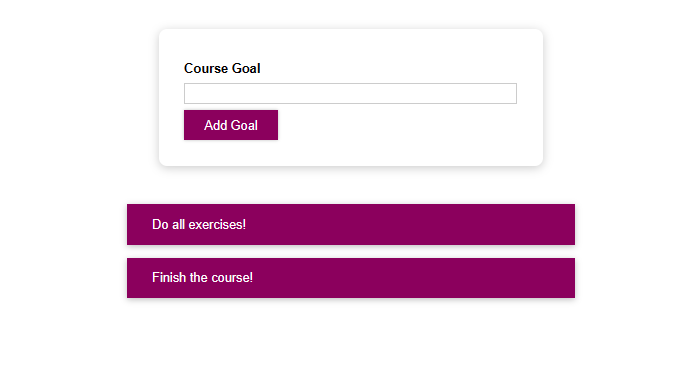

# Course Goal

## Sobre

O Course Goal é uma aplicação simples e intuitiva que permite aos usuários definirem e acompanharem suas metas. Com esta ferramenta, você pode adicionar suas metas, e quando elas forem concluídas, basta clicar nelas para marcá-las como concluídas e automaticamente excluí-las da lista.
Este projeto foi desenvolvido como parte do curso "React - The Complete Guide 2023 (incl. React Router & Redux)" oferecido na plataforma Udemy. 

## Instalação

Para utilizar o Controle de Metas localmente, siga os seguintes passos:

1. Certifique-se de ter o Node.js instalado em sua máquina.

2. Clone este repositório em sua máquina local usando o seguinte comando no terminal: `git clone https://github.com/AndressaARodrigues/react-complete-guide-2.git`

3. Acesse o diretório do projeto: `cd react-complete-guide-2`

4. Instale as dependências do projeto: `npm install`

5. Inicie o servidor de desenvolvimento: `npm start`

6. O aplicativo estará disponível no navegador em http://localhost:3000.

## Tecnologias Utilizadas

O  Course Goal foi desenvolvido utilizando as seguintes tecnologias:

- `React`: Uma biblioteca JavaScript para criar interfaces de usuário interativas.

- `CSS`: Para a estilização dos componentes e páginas.

- `Javascript`: Uma linguagem de programação amplamente utilizada que proporciona interatividade e dinamismo ao projeto. Com o JavaScript, podemos implementar lógica e funcionalidades avançadas para melhorar a experiência do usuário no Course Goal.

